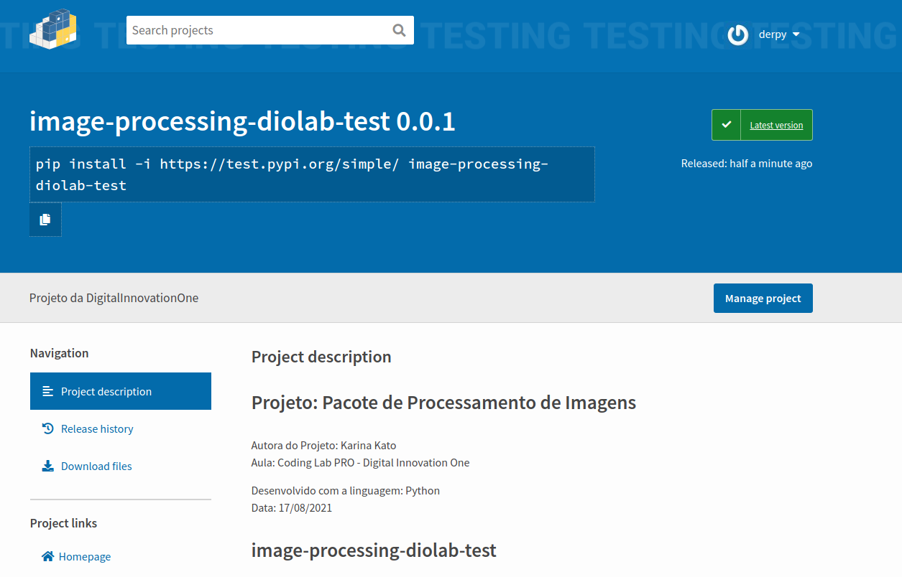

# Projeto: Pacote de Processamento de Imagens

Autora do Projeto: Karina Kato<br>
Aula: Coding Lab PRO - Digital Innovation One

Desenvolvido com a linguagem: Python<br>
Data: 17/08/2021
# image-processing-diolab-test

Descrição. <br>
O pacote image-processing-diolab-test é usado para: <br>
     Processando: <br>
         - Histrograma correspondente <br>
         - Similaridade estrutural <br>
         - Redimensionar imagem <br>
     Utils: <br>
         - Leia a imagem <br>
         - Salvar imagem <br>
         - Imagem do gráfico <br>
         - Resultado do gráfico <br>
         - Traçar histograma
### Passo a passo da configuração para hospedar um pacote em Python no ambiente de testes Test Pypi

Instalação do "setuptools" e "wheel"
```python
python -m pip install -U --upgrade setuptools wheel
```
Instalação do "twine"

```python
python -m pip install -U twine 
```


No diretório do projeto no terminal, o mesmo que esta o arquivo setup.py, este arquivo precisa ser criado e configurado<br>
```bash
/home/derpy/Downloads/dio/projetos/image-processing-diolab-test> python -m pip install -U setuptools
```
Após completar a instalação, verifique se as pastas abaixo foram adicionadas ao projeto:

 - build;
 - dist;
 - image-processing-diolab-test.egg-info.<br>

Agora precisa criar a conta no site de testes https://test.pypi.org/account/register/

Com a conta criada, vamos subir os arquivos, usando o Twine, para o Test Pypi:
```python
python -m twine upload --repository-url https://test.pypi.org/legacy/ dist/**
```
Quando executado, ele vai pedi o usuario e senha da conta criada no test.pypi, após o login, ele vai subir os arquivos e 
vai retorna uma url para você acessa o pacote, ou você pode acessa pela pelo site

### Aqui o objetivo não é utilizar o projeto da Karina para postar em meu perfil do Pypi pessoal. No momento não tenho nenhum projeto para ser usando como pacote.
### No entanto, o Test Pypi, é um ambiente de testes. Para que o projeto esteja disponível como um pacote para ser usado publicamente, é necessário hospedá-lo no site oficial do Pypi.
#### Instalação local, após hospedagem no Test Pypi
 Instalação de dependências
```python
pip install -r requirements.txt
```
Use o pacote [pip](https://pip.pypa.io/en/stable/) para instalar o image-processing-diolab-test
```bash
pip install image-processing-diolab-test
```
### Como utilizar
```python

from image-processing-diolab-test.processing import combination
combination.find_difference(image1, image2)
```


## Author(quem subiu o pacote no test.pypi)
Miele

### License
[MIT](https://choosealicense.com/licenses/mit/)